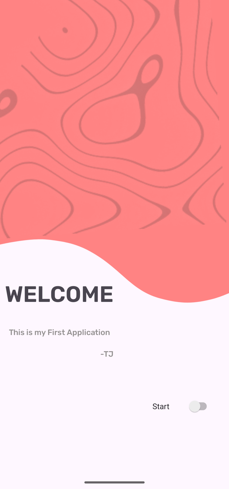
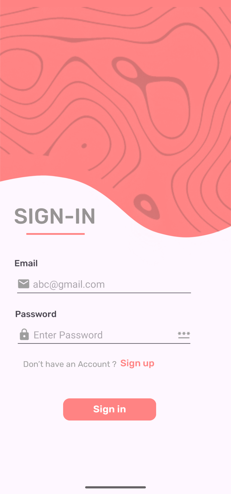
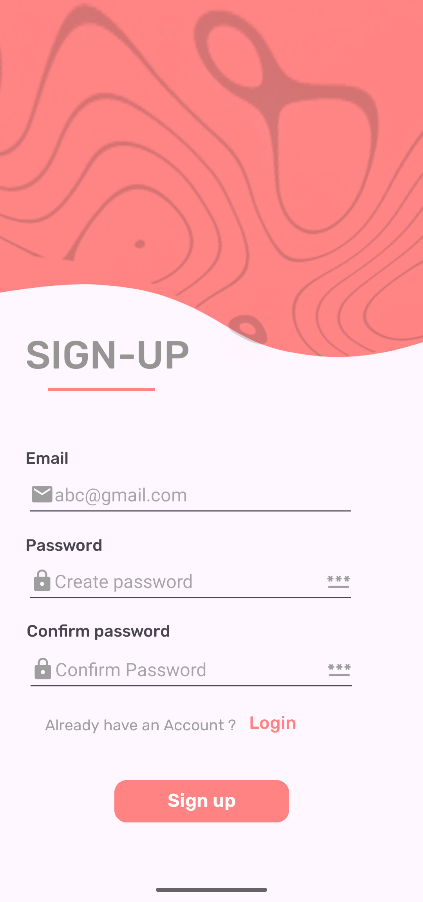
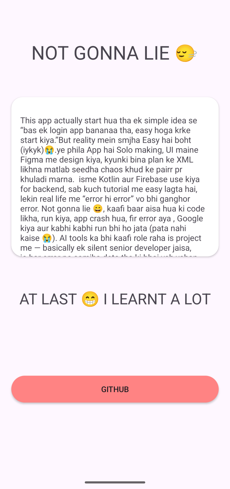

# FirstApp 📱

This project was made while learning Firebase Authentication, Realtime Database, and basic multi-screen navigation using Kotlin.

Not gonna lie 😄  
At first I thought login system would be easy…  
Then Firebase said “hold my JSON file”.

---

## Screenshots

Welcome Screen
<p align="center">
  
</p>
Sign-In Screen
<p align="center">
  
</p>
Sign-Up Screen
<p align="center">
  
</p>
Sign-Up Screen
<p align="center">
  
</p>

---

## ✨ What I Practiced

- Firebase Authentication (Email and Password)
- Firebase Realtime Database
- User Signup and Login flow
- Multiple Activities
- Intent navigation between screens
- Back navigation handling
- Basic form validation

---

## 🛠 Tech Used

- Kotlin
- XML
- Android Studio
- Firebase Authentication
- Firebase Realtime Database

---

## 🎨 App Flow

I kept it simple so I don’t get lost myself 😭


MainActivity → Signup → Login → Home Screen


---

## 💀 Developer Story

At first I thought:
“Bro, login system is just 2 APIs”

Then Firebase came in:

- Authentication worked fine
- Then Realtime Database said “I need rules”
- Then Android said “why your intent not working?”
- Then me said “why am I coding at 2 AM?”

But slowly it started working 😌

---

## 📚 What I Learned

- Firebase Authentication flow
- Storing data in Realtime Database
- Activity lifecycle basics
- Intent navigation
- Debugging without losing sanity (almost)

---

## ⚡ Status

Still learning  
Still breaking things  
Still fixing them later  

But improving 🔥

---

## 🚀 How to Run

Download Git on your system

Clone the repository:

```bash
git clone https://github.com/tejasjadhav0704-sketch/FirstApp.git
```

Then:

1. Open in Android Studio  
2. Add Firebase `google-services.json`  
3. Sync Gradle  
4. Run the app  

---

## 👨‍💻 Author

Tejas Jadhav  
GitHub: https://github.com/tejasjadhav0704-sketch
